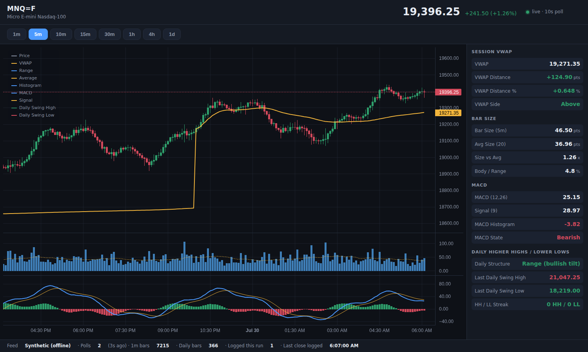
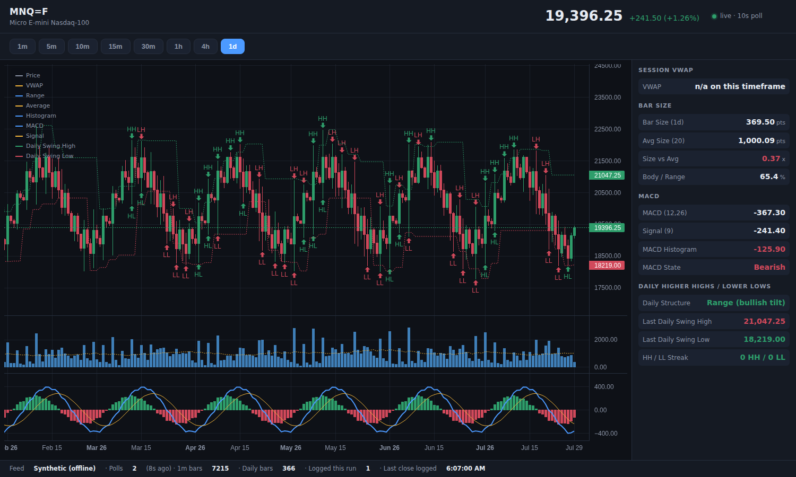

# MNQ Live Dashboard

A local web dashboard for Micro E-mini Nasdaq-100 futures (`MNQ=F`) using free
Yahoo Finance data.

It polls live prices, keeps an append-only log of every 1-minute bar, folds
those minutes into 5m / 10m / 15m / 30m / 1h / 4h / 1d candles, and charts them
with session VWAP, bar-size, MACD and daily higher-high / lower-low structure.



*5-minute chart with session VWAP, bar size, MACD and the daily structure
levels. Screenshots use the offline `synthetic` feed.*

## Quick start

```bash
cd mnq
pip install -r requirements.txt
python run.py
```

Open <http://127.0.0.1:8765>.

No network? Run the offline demo feed — same dashboard, synthetic prices:

```bash
MNQ_FEED=synthetic python run.py
```

## What it shows

| Feature | Where |
| --- | --- |
| Live price, change vs previous session close | header |
| Timeframe switcher — 1m, 5m, 10m, 15m, 30m, 1h, 4h, 1d | button row |
| Candles for the selected timeframe | main pane |
| **Session VWAP** + distance in points and % | orange line, metrics panel |
| **Bar size** — range per bar vs its rolling average | own pane, metrics panel |
| **MACD** (12, 26, 9) for the selected timeframe | own pane, metrics panel |
| **Daily higher highs / lower lows** — HH, LH, HL, LL | markers on 1d, level lines on every timeframe |
| Feed health, bars logged, last bar written | footer |

Every metric is computed for **the timeframe currently on screen**, so the
numbers always describe the candles you are looking at.

On the daily timeframe the swing pivots are labelled directly on the chart:



## How the data flows

```
Yahoo Finance ──poll──▶ 1-minute bars ──▶ append-only log (data/bars/1m/*.jsonl)
                              │
                              └──fold──▶ 5m 10m 15m 30m 1h 4h 1d ──▶ indicators ──▶ chart
```

The 1-minute series is the only thing stored. Every other timeframe is derived
from it on demand, so there is one source of truth and no chance of the
timeframes disagreeing.

Bars are written the moment they close, one file per UTC day, and nothing is
ever rewritten — a corrected bar is appended and supersedes the older record.
The log reloads on startup, so intraday history keeps growing the longer you
run it (Yahoo itself only serves about 7 days of 1-minute data).

## Configuration

Every setting is an environment variable; no file edits required.

| Variable | Default | Meaning |
| --- | --- | --- |
| `MNQ_SYMBOL` | `MNQ=F` | Yahoo ticker. Any symbol works — `ES=F`, `NQ=F`, `AAPL`. |
| `MNQ_FEED` | `yahoo` | `yahoo` or `synthetic`. |
| `MNQ_POLL_SECONDS` | `10` | Seconds between price polls. |
| `MNQ_PORT` / `MNQ_HOST` | `8765` / `127.0.0.1` | Where to serve. |
| `MNQ_INTRADAY_RANGE` | `5d` | History pulled per poll (Yahoo caps 1m at ~7d). |
| `MNQ_DAILY_RANGE` | `1y` | Daily history for market structure. |
| `MNQ_SESSION_TZ` | `America/New_York` | Session timezone. |
| `MNQ_SESSION_OPEN_HOUR` | `18` | Trade date rolls at 18:00 ET (CME Globex). |
| `MNQ_DATA_DIR` | `mnq/data` | Where bar logs are written. |

## Adding to it later

This is built to grow by **adding files, never replacing them**. A new
indicator is one new file in `app/indicators/` — it then appears in the API,
gets its own chart pane and its own metrics automatically, with no changes to
the chart code, the API or any existing indicator.

See **[docs/EXTENDING.md](docs/EXTENDING.md)** for copy-paste recipes, and
**[docs/ARCHITECTURE.md](docs/ARCHITECTURE.md)** for how the pieces fit.

## Tests

```bash
pip install -r requirements-dev.txt
python -m pytest
```

116 tests cover bucketing (including the DST-shifted session), aggregation,
every indicator's maths, the append-only log, the Yahoo response parser
(offline, using recorded payload shapes) and the HTTP + WebSocket API.

## Notes and limits

- Yahoo's free endpoint is **delayed** and unofficial; it is fine for charting
  and study, not for execution. There is no rate-limit guarantee — the 10s
  default poll is deliberately gentle.
- 4h and 1d candles are thin on a fresh install because they are folded from
  whatever 1-minute history exists. They fill in as the log grows. The 1d chart
  uses Yahoo's own daily history (1 year) so market structure works immediately.
- Daily bars are keyed by **session open** (18:00 ET the previous calendar day),
  matching the CME trade date.
